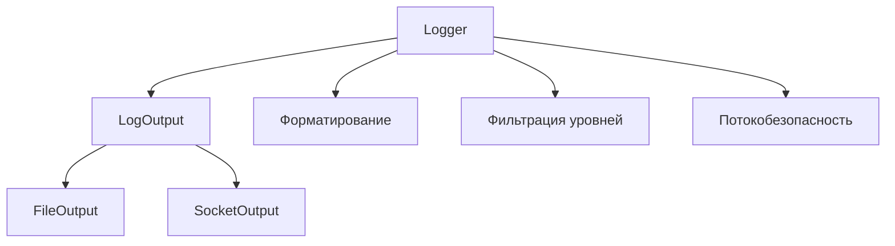

# 📝 Библиотека логирования на C++

[](https://en.cppreference.com/w/cpp/17)
[](https://cmake.org/)
[](https://gcc.gnu.org/)
[](https://ubuntu.com/)

> **Простыми словами:** Это библиотека, которую программисты могут использовать в своих программах для записи важных событий и сообщений в файлы или отправки их по сети. Помогает отслеживать работу программы! 📋

## 🎯 Что это такое?

**Логирование** - это когда программа записывает информацию о важных событиях в своей работе:
- ✅ "Пользователь вошёл в систему"  
- ❌ "Произошла ошибка при сохранении файла"
- 🚀 "Программа запустилась успешно"

Эта библиотека предоставляет программистам удобные инструменты для добавления логирования в их программы.

## ✨ Возможности библиотеки

| Функция | Описание | Значок |
|---------|----------|---------|
| **Многопоточность** | Несколько потоков могут писать логи одновременно | 🔒 |
| **Фильтрация** | Показывает только сообщения нужного уровня важности | 📊 |
| **Файловое логирование** | Сохраняет все записи в файлы на диске | 📁 |
| **Сетевое логирование** | Отправляет логи по сети другим программам | 🌐 |
| **Форматирование** | Автоматически добавляет время и уровень важности | ⏰ |
| **Статистика** | Собирает статистику по количеству и типам сообщений | 📈 |

## 🏗️ Структура проекта

```
LoggingLibrary/                    # 📦 Главная папка проекта
├── 📄 README.md                   # 📖 Эта инструкция
├── 📄 CMakeLists.txt              # 🔧 Главный файл сборки
├── 📂 include/logging/            # 🔧 Заголовочные файлы
│   └── Logger.h                   # 📋 Интерфейс библиотеки
├── 📂 src/                        # ⚙️ Исходный код библиотеки
│   ├── CMakeLists.txt            # 🔧 Настройки сборки библиотеки
│   └── Logger.cpp                # 💻 Реализация функций
├── 📂 apps/                       # 🎮 Готовые приложения
│   ├── test_logger/              # 💬 Интерактивное приложение
│   │   ├── CMakeLists.txt        
│   │   └── main.cpp
│   └── log_stats/                # 📊 Анализатор статистики
│       ├── CMakeLists.txt
│       └── main.cpp
└── 📂 tests/                      # 🧪 Автоматические тесты
    ├── CMakeLists.txt
    └── unit_tests.cpp            # ✅ Тесты всех функций
```

## 🚀 Быстрый старт

### Шаг 1: Установка и сборка

```bash
# Скачиваем проект
git clone <https://github.com/sofikuz274/Logging_library>
cd LoggingLibrary

# Создаём папку для сборки
mkdir build && cd build

# Настраиваем проект
cmake ..

# Собираем всё
make

# Проверяем, что всё работает
make test
```

### Шаг 2: Первый пример использования

Создайте файл `example.cpp`:

```cpp
#include "logging/Logger.h"

int main() {
    // Создаём логгер для записи в файл
    logging::Logger logger("application.log", logging::LogLevel::INFO);
    
    // Проверяем, что логгер готов к работе
    if (!logger.isValid()) {
        std::cerr << "Ошибка создания логгера!" << std::endl;
        return 1;
    }
    
    // Записываем разные типы сообщений
    logger.info("🚀 Приложение запущено");
    logger.warning("⚠️ Внимание: мало свободного места");
    logger.debug("🐛 Эта отладочная информация не запишется (уровень ниже INFO)");
    
    // Изменяем уровень фильтрации
    logger.setDefaultLevel(logging::LogLevel::DEBUG);
    logger.debug("🐛 А теперь отладочная информация запишется!");
    
    return 0;
}
```

**Результат в файле `application.log`:**
```
[2024-01-15 14:30:25.123] [INFO] 🚀 Приложение запущено
[2024-01-15 14:30:25.456] [WARNING] ⚠️ Внимание: мало свободного места
[2024-01-15 14:30:25.789] [DEBUG] 🐛 А теперь отладочная информация запишется!
```

## 📊 Уровни важности сообщений

| Уровень | Значок | Описание | Когда использовать |
|---------|---------|----------|-------------------|
| **DEBUG** | 🐛 | Подробная отладочная информация | "Переменная X = 42", "Вызов функции Y" |
| **INFO** | ℹ️ | Обычная информация о работе | "Пользователь вошёл", "Файл сохранён" |
| **WARNING** | ⚠️ | Предупреждения и ошибки | "Мало места на диске", "Сетевая задержка" |

> **💡 Умная фильтрация:** Если установить уровень INFO, то сообщения DEBUG показываться не будут (они менее важные). WARNING всегда показывается.

## 🎮 Готовые приложения

### 💬 test_logger - Интерактивное тестирование

Позволяет вручную вводить сообщения и наблюдать, как они записываются в файл.

```bash
# Запуск приложения
./build/apps/test_logger/test_logger my_log.log INFO

# Интерактивный ввод:
Введите сообщения для записи в журнал (quit для выхода):
> Привет, мир!                    # → записывается с уровнем INFO
> WARNING: Мало памяти            # → записывается как WARNING
> DEBUG Отладочная информация     # → записывается как DEBUG
> quit                           # → выход из программы
```

**Форматы ввода:**
- `сообщение` - использует уровень по умолчанию
- `УРОВЕНЬ: сообщение` - явно указывает уровень
- `УРОВЕНЬ сообщение` - альтернативный формат

### 📊 log_stats - Анализатор статистики

Принимает логи по сети и показывает статистику в реальном времени.

```bash
# Запуск анализатора
./build/apps/log_stats/log_stats 12345 10 30
# Порт: 12345, статистика каждые 10 сообщений или каждые 30 секунд
```

**Пример использования с сетевым логированием:**

```cpp
// В вашей программе
logging::Logger logger("127.0.0.1", 12345, logging::LogLevel::INFO);
logger.info("Сообщение будет отправлено в анализатор статистики");
```

**Статистика показывает:**
- 📈 Общее количество сообщений
- 📊 Распределение по уровням (DEBUG/INFO/WARNING)
- ⏱️ Количество сообщений за последний час  
- 📏 Минимальную, максимальную и среднюю длину сообщений

## 🔧 Продвинутое использование

### Многопоточное логирование

```cpp
#include "logging/Logger.h"
#include <thread>
#include <vector>

void workerFunction(logging::Logger& logger, int threadId) {
    for (int i = 0; i < 10; ++i) {
        logger.info("Поток " + std::to_string(threadId) + 
                   " сообщение " + std::to_string(i));
    }
}

int main() {
    logging::Logger logger("multithreaded.log", logging::LogLevel::INFO);
    
    // Запускаем 5 потоков одновременно
    std::vector<std::thread> threads;
    for (int i = 0; i < 5; ++i) {
        threads.emplace_back(workerFunction, std::ref(logger), i);
    }
    
    // Ждём завершения всех потоков
    for (auto& t : threads) {
        t.join();
    }
    
    return 0;
}
```

### Сетевое логирование

```cpp
#include "logging/Logger.h"

int main() {
    // Создаём логгер для отправки по сети
    logging::Logger logger("192.168.1.100", 12345, logging::LogLevel::INFO);
    
    if (!logger.isValid()) {
        std::cerr << "Не удалось подключиться к серверу логов" << std::endl;
        return 1;
    }
    
    logger.info("Это сообщение отправится по сети!");
    
    return 0;
}
```

### Изменение настроек во время работы

```cpp
logging::Logger logger("app.log", logging::LogLevel::WARNING);

// Сначала записываются только WARNING
logger.info("Это сообщение не запишется");
logger.warning("А это запишется");

// Меняем уровень на более подробный
logger.setDefaultLevel(logging::LogLevel::DEBUG);

// Теперь записывается всё
logger.debug("Теперь и отладочная информация записывается");
logger.info("И обычная информация тоже");
```

## 🧪 Тестирование

В проекте есть подробные автоматические тесты, которые проверяют все функции:

```bash
# Запуск всех тестов
cd build
make test

# Или с подробным выводом
ctest --verbose

# Или запуск тестов напрямую
./tests/unit_tests
```

**Что тестируется:**
- ✅ Базовая запись сообщений
- ✅ Фильтрация по уровням важности
- ✅ Многопоточная безопасность
- ✅ Форматирование временных меток
- ✅ Работа с большими сообщениями
- ✅ Обработка ошибок
- ✅ Производительность

## 📋 Системные требования

| Компонент | Версия | Примечание |
|-----------|---------|------------|
| **Операционная система** | Ubuntu/Debian | Протестировано на актуальных версиях |
| **Компилятор** | GCC с C++17 | Стандартная установка |
| **Система сборки** | CMake 3.12+ | `sudo apt install cmake` |
| **Зависимости** | pthread | Входит в стандартную поставку |

### Установка зависимостей (Ubuntu/Debian):

```bash
sudo apt update
sudo apt install build-essential cmake git
```

## 🔍 Диагностика проблем

### Проблема: "Ошибка создания логгера"
```cpp
logging::Logger logger("test.log", logging::LogLevel::INFO);
if (!logger.isValid()) {
    // Возможные причины:
    // 1. Нет прав на запись в папку
    // 2. Диск переполнен
    // 3. Неверный путь к файлу
}
```

**Решение:** Проверьте права доступа и свободное место на диске.

### Проблема: "Не удалось подключиться к серверу логов"
```cpp
logging::Logger logger("192.168.1.100", 12345, logging::LogLevel::INFO);
if (!logger.isValid()) {
    // Возможные причины:
    // 1. Сервер недоступен
    // 2. Неверный порт
    // 3. Проблемы с сетью
}
```

**Решение:** Убедитесь, что сервер запущен и порт доступен.

## 🚀 Демонстрация

Для быстрой демонстрации всех возможностей:

```bash
cd build
make demo
```

Эта команда:
1. 🧪 Запустит все тесты
2. 💬 Покажет пример работы интерактивного приложения
3. 📊 Продемонстрирует сбор статистики

## 🎯 Архитектура решения

### Основные компоненты:



### Принципы проектирования:
- 🎭 **Полиморфизм** - единый интерфейс для разных способов вывода
- 🔒 **Инкапсуляция** - скрытие внутренних деталей
- 🛡️ **RAII** - автоматическое управление ресурсами
- 🧵 **Потокобезопасность** - безопасная работа в многопоточных приложениях

## 💡 Примеры реального использования

### Веб-сервер
```cpp
logging::Logger webLogger("web_server.log", logging::LogLevel::INFO);
webLogger.info("Сервер запущен на порту 8080");
webLogger.warning("Высокая нагрузка: 95% CPU");
```

### Игровое приложение
```cpp
logging::Logger gameLogger("game.log", logging::LogLevel::DEBUG);
gameLogger.debug("Игрок переместился в позицию (100, 200)");
gameLogger.info("Уровень пройден за 05:23");
gameLogger.warning("Соединение с сервером нестабильно");
```

### Система мониторинга
```cpp
// Отправка критических событий по сети
logging::Logger monitorLogger("monitoring.local", 9999, logging::LogLevel::WARNING);
monitorLogger.warning("Температура сервера: 85°C");
```

## 📞 Поддержка

При возникновении вопросов или предложений по улучшению:
- 🐛 Создайте issue в репозитории проекта
- 📧 Опишите подробно проблему и шаги для её воспроизведения
- 💡 Предложения по улучшению приветствуются!

## 📜 Лицензия

Этот проект создан в **учебных целях** и предназначен для изучения принципов разработки библиотек на C++. Не предназначен для коммерческого использования без дополнительной доработки.

---
